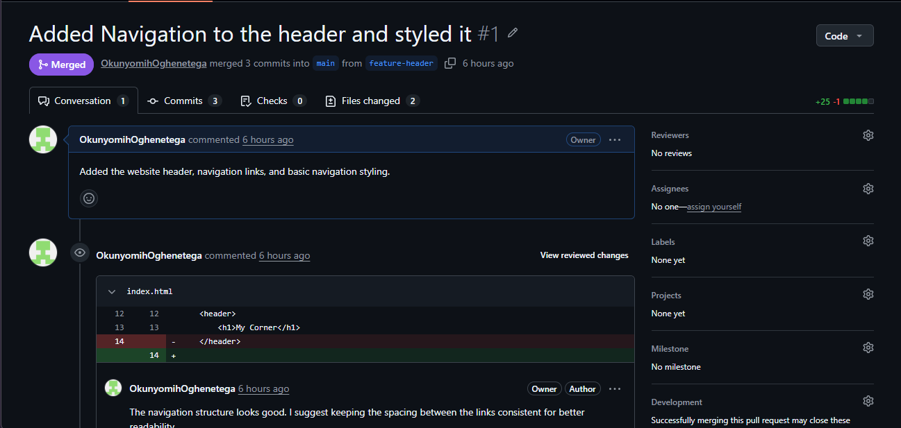
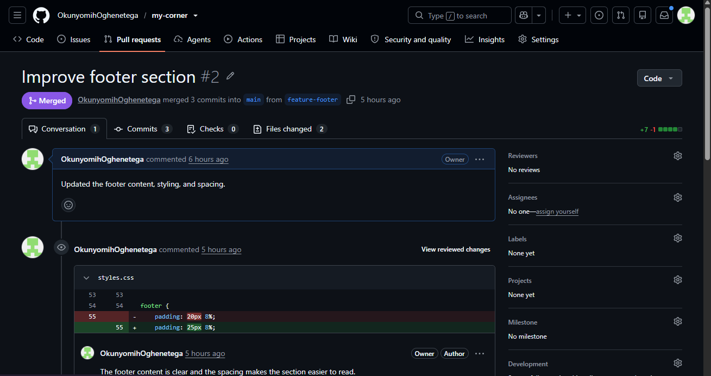

# My Corner
A simple frontend project created to demonstrate Git and GitHub version control workflows.

## Branches

### main
The main branch containing the stable version of the project.

### feature-header
Used to develop and style the website header and navigation.

### feature-footer
Used to develop and style the website footer.

### feature-renamed
Created to demonstrate branch renaming and fetching remote updates.

## Git Commands Used

- `git init` - Initializes a Git repository.
- `git add` - Stages changes for a commit.
- `git commit` - Saves changes to the Git history.
- `git branch` - Displays available branches.
- `git switch` - Switches between branches.
- `git push` - Sends local changes to GitHub.
- `git pull` - Downloads and integrates changes from GitHub.
- `git fetch` - Downloads information about changes from the remote repository.
- `git merge` - Combines changes from different branches.
- `git revert` - Creates a new commit that reverses a previous commit.
- `git remote` - Manages the connection between the local repository and GitHub.

## Pull Requests

The project includes Pull Requests for:

- Feature header
- Feature footer

Both Pull Requests were reviewed with comments and successfully merged into the main branch.
### Header Pull Request

### Footer Pull Request

## Version Control Workflow

The project followed this workflow:

1. Created the repository.
2. Created feature branches.
3. Developed features separately.
4. Made multiple meaningful commits.
5. Pushed branches to GitHub.
6. Created Pull Requests.
7. Reviewed the changes.
8. Merged the Pull Requests into `main`.
9. Practiced reverting a commit.
10. Renamed a branch and fetched remote information.

## Lessons Learned

This project helped me understand how Git tracks changes and how branches can be used to work on different features without affecting the main project.

I learned how to create and manage branches, write meaningful commit messages, push and pull changes, create Pull Requests, review changes, merge branches, and safely undo changes using `git revert`.

I also learned the difference between local and remote repositories and how `git fetch` can be used to update information about a remote repository.